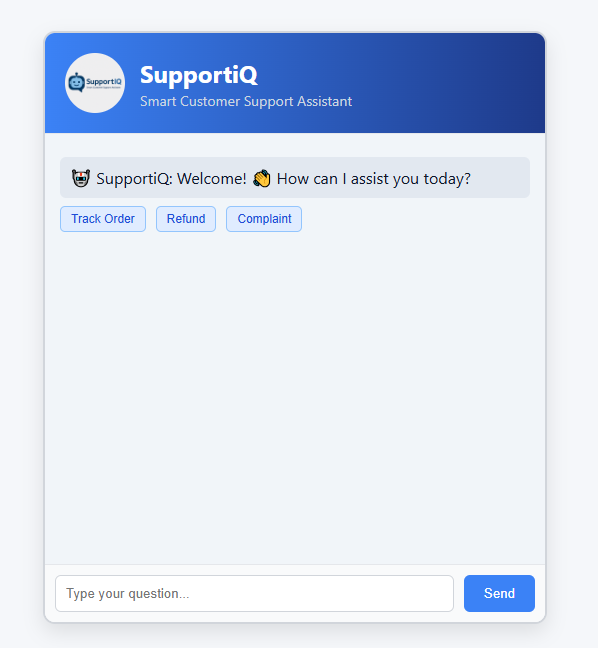

This is a professional AI-powered Customer Support Chatbot built using rule-based Natural Language Processing (NLP) techniques. The bot is designed to handle frequently asked customer service queries such as order status, refund requests, shipping policies, technical issues, and more.
---
📁 Internship Task for Snestron – Develop an AI-Based Chatbot for Customer Support using NLP

## 🔧 Technologies Used

- 🧠 Python
- 🗣️ NLP (scikit-learn, NLTK)
- 🌐 Flask (Web Framework)
- 🎨 HTML, CSS (Frontend)
- 🧾 JSON (Intents data)

---

## 📦 Features

- 🧠 Intent classification using Logistic Regression
- 🔍 Predefined JSON-based intent structure
- 💬 Real-time interaction with typing effect
- 🖼️ Blue-grey-white themed responsive UI
- 🔁 Quick reply suggestion buttons
- ⏰ Timestamped messages
- 🤖 Custom bot branding: **SupportiQ**
- 📁 Clean folder structure

---

## 🚀 Getting Started

1. Clone the repository

```bash
git clone https://github.com/amansinghh1/Chatbot-for-Customer-Support-using-NLP.git
cd "AI Customer Support Chatbot"

2. Install dependencies
pip install -r requirements.txt

3. Run the Flask server
python app.py Then go to 👉 http://127.0.0.1:5000 in your browser.

---

🗂️ Project Structure
**AI Customer Support Chatbot/
├── app.py                # Flask app
├── train.py              # Model training script
├── chatbot/
│   ├── intents.json      # User intents file
│   └── intent_model.pkl  # Trained ML model
├── static/
│   ├── style.css         # UI styling
│   └── logo.png          # Bot logo
├── templates/
│   └── index.html        # Chat interface
├── requirements.txt
└── README.md
**

---

---

## 🎥 Demo Video

  
[📽️ Download Demo](assets/demo.mp4)

---

## 🖼️ UI Preview

> 

---

✅ Certification Note This repository is submitted as part of the official AI Internship Task at Snestron Internships – focused on building real-world NLP solutions.


